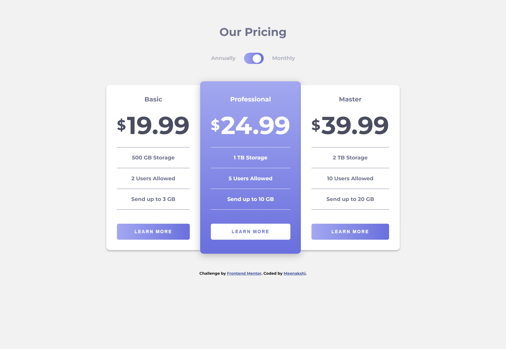
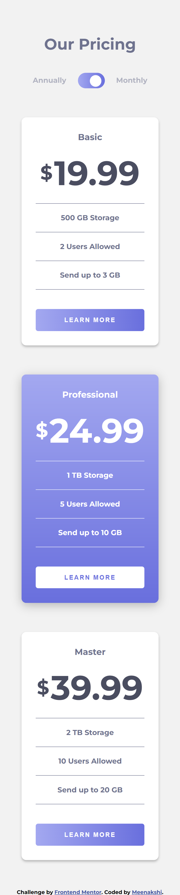

# Frontend Mentor - Pricing component with toggle solution

This is a solution to the [Pricing component with toggle challenge on Frontend Mentor](https://www.frontendmentor.io/challenges/pricing-component-with-toggle-8vPwRMIC). Frontend Mentor challenges help you improve your coding skills by building realistic projects.

## Table of contents

- [Overview](#overview)
  - [The challenge](#the-challenge)
  - [Screenshot](#screenshot)
  - [Links](#links)
- [My process](#my-process)
  - [Built with](#built-with)
  - [What I learned](#what-i-learned)
- [Author](#author)

## Overview

### The challenge

Users should be able to:

- View the optimal layout for the component depending on their device's screen size
- Control the toggle with both their mouse/trackpad and their keyboard
- **Bonus**: Complete the challenge with just HTML and CSS

### Screenshot

### Links

- Solution URL: [Solution URL](https://github.com/Memeena/pricing-component-main-toggle-master-app/tree/master)
- Live Site URL: [Live site URL](https://memeena.github.io/pricing-component-main-toggle-master-app/)

## My process

### Built with

- Semantic HTML5 markup
- CSS custom properties
- Flexbox
- CSS Grid
- Desktop-first workflow
- [React](https://reactjs.org/) - JS library

### What I learned

Have used dynamic styles to style the cards.

Approach:

- Created an array of objects with the card details which includes heading, price, storage, users, limit, plan, id.
- Created a div which selects the plan based on the toggle State which is by default in "monthly" plan and set to false
  -- Adding event listener to handle the click event in the toggle icon(which is created using div)
- After selecting the plan, filtering the card Elements array with the dynamically selected plan and passing those elements to the card component.
- In the card component, styling is done dynamically based on the selected plan which is passed as props.

## Author

- Frontend Mentor - [@meMeena](https://www.frontendmentor.io/profile/meMeena)
- Twitter - [@Mekrish18](https://www.twitter.com/MeKrish18)
